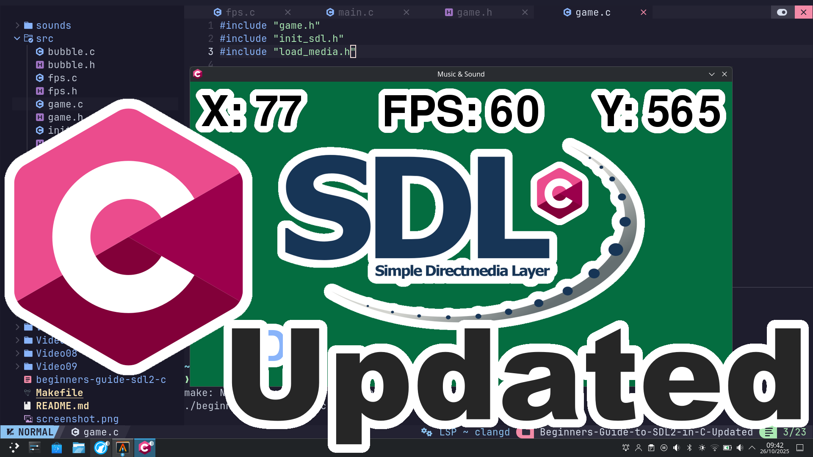

# An in-depth guide to getting started with SDL2 in the C Language (Updated).

# SDL2 Install Instruction.
You will need to make sure sdl2, sdl2_image, sdl2_ttf and sdl2_mixer are installed.
## Archlinux
```
sudo pacman -S --needed base-devel sdl2 sdl2_image sdl2_mixer sdl2_ttf
```
## MacOS
```
brew install sdl2 sdl2_image sdl2_mixer sdl2_ttf
```
# Clone and build project.
```
cd
git clone https://github.com/ProgrammingRainbow/Beginners-Guide-to-SDL2-in-C-Updated
cd Beginners-Guide-to-SDL2-in-C-Updated
make run
```
The Makefile supports these commands:
```
make rebuild
make clean
make release
make debug
SRC_DIR=Video8 make rebuild run
```
# Controls
Space - Changes the background Color\
Arrows - Moves Player Sprite\
A, S, W, D, - Moves Player Sprite\
M - Toggles Music\
N - Toggles Sound Effects\
F - Toggles displaying FPS\
P - Toggles displaying sprite position\
Escape - Quits
